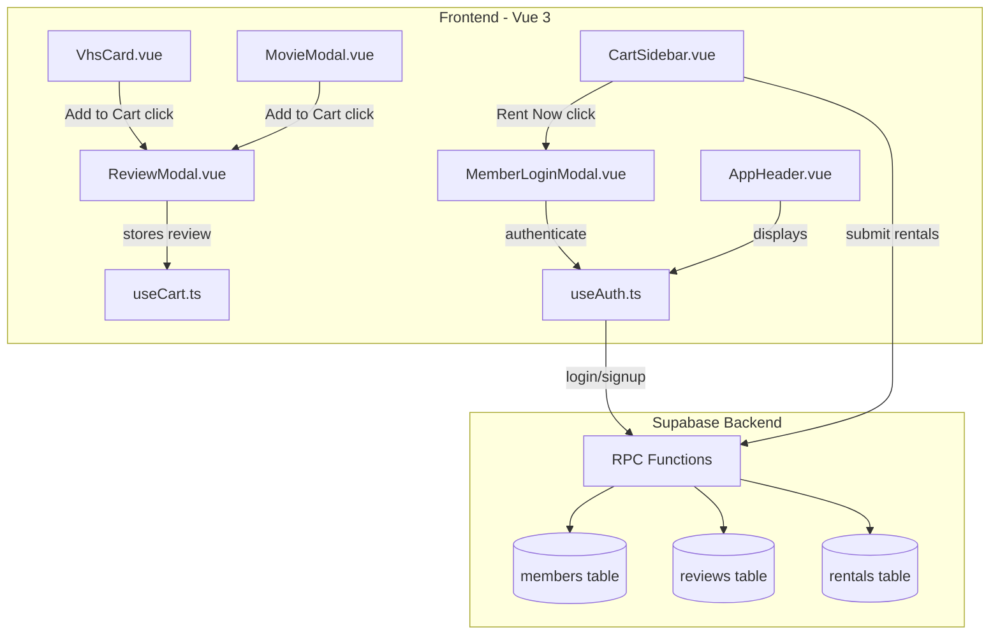

# Movie Review Feature with Supabase Integration

## Architecture Overview

## Phase 1: Git Setup and Dependencies

### Step 1.1: Create feature branch

Create a new local branch `feature/movie-reviews` from current HEAD.

### Step 1.2: Install Supabase client

Add `@supabase/supabase-js` to dependencies in [package.json](package.json).

### Step 1.3: Add environment variables

Update [src/config/env.ts](src/config/env.ts) to include Supabase configuration alongside existing TMDB config.---

## Phase 2: Supabase Database Setup (Manual)

You will need to run the following SQL in your Supabase SQL Editor. This creates:

- `members` table with auto-generated member numbers (MV-198X-XXXX format)
- `reviews` table for movie reviews (1-5 stars, 500 char text)
- `rentals` table for rental history
- RPC functions for signup, login, and rental submission
- Row Level Security policies

I will provide the complete SQL script as a new file `supabase/schema.sql` for reference.---

## Phase 3: New Type Definitions

### Step 3.1: Create member types

New file `src/types/member.ts` defining:

- `Member` interface (id, memberNumber, name, memberSince)
- `CartReview` interface (rating, text)
- `CartItem` interface (movie + optional review)

---

## Phase 4: Supabase Service Layer

### Step 4.1: Create Supabase client

New file `src/services/supabaseClient.ts` - initializes Supabase client with env vars.

### Step 4.2: Create rental service

New file `src/services/rentalService.ts` - handles submitting rentals and reviews to Supabase.---

## Phase 5: Composables

### Step 5.1: Create auth composable

New file `src/composables/useAuth.ts` with:

- `signup(name, pin)` - creates new member, returns member card number
- `login(memberNumber, pin)` - authenticates existing member
- `logout()` - clears session
- `restoreSession()` - restores from localStorage
- Reactive state: `currentMember`, `isLoggedIn`, `memberNumber`, `memberName`

### Step 5.2: Modify cart composable

Update [src/composables/useCart.ts](src/composables/useCart.ts) to:

- Store `CartItem` objects (movie + optional review) instead of just movies
- Add `updateReview(movieId, review)` method
- Add `getReview(movieId)` method
- Maintain backward compatibility with `movies` computed property

---

## Phase 6: New Components

### Step 6.1: Create ReviewModal component

New file `src/components/ReviewModal.vue`:

- Shows movie poster and title
- 5-star rating selector with hover effects
- Optional 500-character review text area
- "Skip" and "Add to Cart" buttons
- Emits review data or null on submit

### Step 6.2: Create MemberLoginModal component

New file `src/components/MemberLoginModal.vue`:

- Toggle between login and signup modes
- Login: member number + 4-digit PIN
- Signup: name + 4-digit PIN (with confirmation)
- Error handling and loading states
- 80s-themed styling matching existing modals

---

## Phase 7: Component Modifications

### Step 7.1: Update VhsCard

Modify [src/components/VhsCard.vue](src/components/VhsCard.vue):

- Emit event to trigger ReviewModal instead of directly adding to cart
- Change `handleCartClick` to emit `'add-to-cart-request'` event

### Step 7.2: Update MovieModal

Modify [src/components/MovieModal.vue](src/components/MovieModal.vue):

- Same change - emit event to trigger ReviewModal

### Step 7.3: Update CartSidebar

Modify [src/components/CartSidebar.vue](src/components/CartSidebar.vue):

- Display review indicator (star rating) next to cart items that have reviews
- Pass through to checkout flow

### Step 7.4: Update AppHeader

Modify [src/components/AppHeader.vue](src/components/AppHeader.vue):

- Show member card number when logged in
- Add logout button

### Step 7.5: Update CheckoutModal

Modify [src/components/CheckoutModal.vue](src/components/CheckoutModal.vue):

- Display member card number on receipt
- Show count of reviews submitted

---

## Phase 8: Main App Integration

### Step 8.1: Update App.vue

Modify [src/App.vue](src/App.vue):

- Import and manage ReviewModal state
- Import and manage MemberLoginModal state
- Add `useAuth` composable with session restoration on mount
- Handle new cart flow:

1. VhsCard/MovieModal emits add-to-cart-request
2. Show ReviewModal
3. On review submit, add to cart with optional review

- Handle checkout flow:

1. User clicks "Rent Now"
2. If not logged in, show MemberLoginModal
3. On login success, submit rentals to Supabase
4. Show CheckoutModal success

---